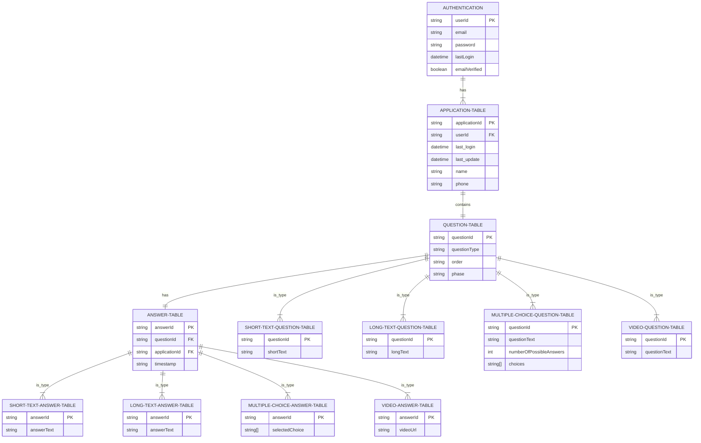

## Appliaction ER-Diagram

```mermaid
erDiagram
    AUTHENTICATION ||--|{ APPLICATION-TABLE : has
    APPLICATION-TABLE ||--|| QUESTION-TABLE : contains
    QUESTION-TABLE ||--|| ANSWER-TABLE : has
    ANSWER-TABLE ||--|{ SHORT-TEXT-ANSWER-TABLE : is_type
    ANSWER-TABLE ||--|{ LONG-TEXT-ANSWER-TABLE : is_type
    ANSWER-TABLE ||--|{ MULTIPLE-CHOICE-ANSWER-TABLE : is_type
    ANSWER-TABLE ||--|{ VIDEO-ANSWER-TABLE : is_type
    QUESTION-TABLE ||--|{ SHORT-TEXT-QUESTION-TABLE : is_type
    QUESTION-TABLE ||--|{ LONG-TEXT-QUESTION-TABLE : is_type
    QUESTION-TABLE ||--|{ MULTIPLE-CHOICE-QUESTION-TABLE : is_type
    QUESTION-TABLE ||--|{ VIDEO-QUESTION-TABLE : is_type

    AUTHENTICATION {
        string userId PK
        string email
        string password
        datetime lastLogin
        boolean emailVerified
    }
    
    APPLICATION-TABLE {
        string applicationId PK
        string userId FK
        datetime last_login
        datetime last_update
        string name
        string phone
    }

    QUESTION-TABLE {
        string questionId PK
        string questionType
        string order
        string phase
    }
    
    ANSWER-TABLE {
        string answerId PK
        string questionId FK
        string applicationId FK
        string timestamp
    }

    SHORT-TEXT-QUESTION-TABLE {
    string questionId PK
    string shortText
    }
    
    LONG-TEXT-QUESTION-TABLE {
    string questionId PK
    string longText
    }
    
    MULTIPLE-CHOICE-QUESTION-TABLE {
        string questionId PK
        string questionText
        int numberOfPossibleAnswers
        string[] choices
    }
    
    VIDEO-QUESTION-TABLE {
        string questionId PK
        string questionText
    }

    SHORT-TEXT-ANSWER-TABLE {
        string answerId PK
        string answerText
    }
    
    LONG-TEXT-ANSWER-TABLE {
        string answerId PK
        string answerText
    }

    MULTIPLE-CHOICE-ANSWER-TABLE {
        string answerId PK
        string[] selectedChoice
    }
    
    VIDEO-ANSWER-TABLE {
        string answerId PK
        string videoUrl
    }
```