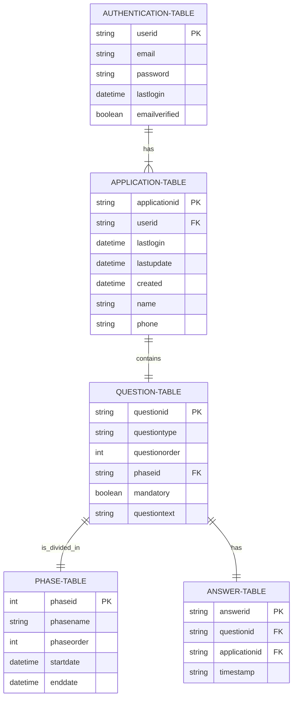

## Application ER-Diagram

### Top Level Overview

```mermaid
erDiagram
    AUTHENTICATION-TABLE ||--|{ APPLICATION-TABLE : has
    APPLICATION-TABLE ||--|| QUESTION-TABLE : contains
    QUESTION-TABLE ||--|| PHASE-TABLE : is_divided_in
    QUESTION-TABLE ||--|| ANSWER-TABLE : has

    %% default Supabase Authentication Table
    AUTHENTICATION-TABLE {
        string userid PK
        string email
        string password
        datetime lastlogin
        boolean emailverified
    }

    APPLICATION-TABLE {
        string applicationid PK
        string userid FK
        datetime lastlogin
        datetime lastupdate
        datetime created
        string name
        string phone
    }

    PHASE-TABLE {
        int phaseid PK
        string phasename
        int phaseorder
        datetime startdate
        datetime enddate
    }

    QUESTION-TABLE {
        string questionid PK
        string questiontype
        int questionorder
        string phaseid FK
        boolean mandatory
        string questiontext
    }

    ANSWER-TABLE {
        string answerid PK
        string questionid FK
        string applicationid FK
        string timestamp
    }
```

### Questions

```mermaid
erDiagram
    QUESTION-TABLE ||--|{ SHORT-TEXT-QUESTION-TABLE : is_type
    QUESTION-TABLE ||--|{ LONG-TEXT-QUESTION-TABLE : is_type
    QUESTION-TABLE ||--|{ MULTIPLE-CHOICE-QUESTION-TABLE : is_type
    QUESTION-TABLE ||--|{ VIDEO-UPLOAD-QUESTION-TABLE : is_type
    QUESTION-TABLE ||--|{ DATE-PICKER-QUESTION-TABLE : is_type
    QUESTION-TABLE ||--|{ DATETIME-PICKER-QUESTION-TABLE : is_type
    QUESTION-TABLE ||--|{ NUMBER-PICKER-QUESTION-TABLE : is_type
    QUESTION-TABLE ||--|{ DROPDOWN-QUESTION-TABLE : is_type
    QUESTION-TABLE ||--|{ PDF-UPLOAD-QUESTION-TABLE : is_type
    QUESTION-TABLE ||--|{ IMAGE-UPLOAD-QUESTION-TABLE : is_type
    DROPDOWN-QUESTION-TABLE ||--|{ DROPDOWN-QUESTION-OPTION-TABLE : has
    MULTIPLE-CHOICE-QUESTION-TABLE ||--|{ MULTIPLE-CHOICE-QUESTION-CHOICES-TABLE : has

    QUESTION-TABLE {
        string questionid PK
        string questiontype
        int questionorder
        string phaseid FK
        boolean mandatory
        string questiontext
    }

    SHORT-TEXT-QUESTION-TABLE {
        string questionid FK
    }

    LONG-TEXT-QUESTION-TABLE {
        string questionid FK
    }

    MULTIPLE-CHOICE-QUESTION-TABLE {
        string questionid FK
        int minanswers
        int maxanswers
    }

    MULTIPLE-CHOICE-QUESTION-CHOICES-TABLE {
        string choiceid PK
        string questionid FK
        string choicetext
    }

    VIDEO-UPLOAD-QUESTION-TABLE {
        string questionid FK
        double maxfilesizeinmb
    }

    DATE-PICKER-QUESTION-TABLE {
        string questionid FK
        date mindate
        data maxdate
    }

    DATETIME-PICKER-QUESTION-TABLE {
        string questionid FK
        datetime mindatetime
        datatime maxdatetime
    }

    NUMBER-PICKER-QUESTION-TABLE {
        string questionid FK
        int minnumber
        int maxnumber
    }

    DROPDOWN-QUESTION-TABLE {
        string questionid FK
        integer minanswers
        integer maxanswers
        boolean userinput
    }

    DROPDOWN-QUESTION-OPTION-TABLE {
        string optionid PK
        string questionid FK
        string optiontext
    }

    PDF-UPLOAD-QUESTION-TABLE {
        string questionid FK
        double maxfilesizeinmb
    }

    IMAGE-UPLOAD-QUESTION-TABLE {
        string questionid FK
        double maxfilesizeinmb
        string[] allowedfiletypes
    }
```

### Answers

```mermaid
erDiagram
    ANSWER-TABLE ||--|{ SHORT-TEXT-ANSWER-TABLE : is_type
    ANSWER-TABLE ||--|{ LONG-TEXT-ANSWER-TABLE : is_type
    ANSWER-TABLE ||--|{ MULTIPLE-CHOICE-ANSWER-TABLE : is_type
    ANSWER-TABLE ||--|{ VIDEO-UPLOAD-ANSWER-TABLE : is_type
    ANSWER-TABLE ||--|{ DATE-PICKER-ANSWER-TABLE : is_type
    ANSWER-TABLE ||--|{ DATETIME-PICKER-ANSWER-TABLE : is_type
    ANSWER-TABLE ||--|{ NUMBER-PICKER-ANSWER-TABLE : is_type
    ANSWER-TABLE ||--|{ DROPDOWN-ANSWER-TABLE : is_type
    ANSWER-TABLE ||--|{ PDF-UPLOAD-ANSWER-TABLE : is_type
    ANSWER-TABLE ||--|{ IMAGE-UPLOAD-ANSWER-TABLE : is_type

    ANSWER-TABLE {
        string answerid PK
        string questionid FK
        string applicationid FK
        string timestamp
    }

    SHORT-TEXT-ANSWER-TABLE {
        string answerid FK
        string answertext
    }

    LONG-TEXT-ANSWER-TABLE {
        string answerid FK
        string answertext
    }

    MULTIPLE-CHOICE-ANSWER-TABLE {
        string answerid FK
        string[] selectedchoice
    }

    VIDEO-UPLOAD-ANSWER-TABLE {
        string answerid FK
        string videourl
    }

    DATE-PICKER-ANSWER-TABLE {
        string answerid FK
        date pickeddate
    }

    DATETIME-PICKER-ANSWER-TABLE {
        string answerid FK
        datetime pickeddatetime
    }

    NUMBER-PICKER-ANSWER-TABLE {
        string answerid FK
        integer pickednumber
    }

    DROPDOWN-ANSWER-TABLE {
        string answerid FK
        string[] selectedoptions
    }

    PDF-UPLOAD-ANSWER-TABLE {
        string answerid FK
        string pdfurl
    }

    IMAGE-UPLOAD-ANSWER-TABLE {
        string answerid FK
        string imageurl
    }
```